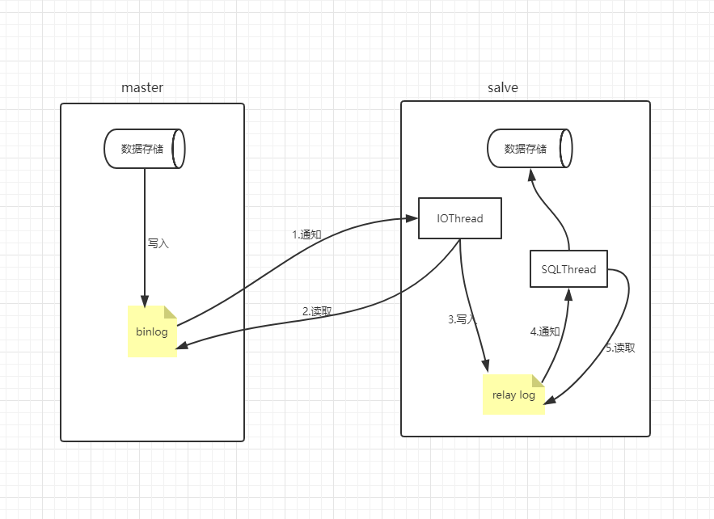

### mysql_binlog

记录mysql的数据更新或者潜在更新

1. 潜在更新：`delete from table where id = x`当不存在x的id，并没有报错，也会被记录下来
2. 主从复制依赖binlog，`master-salve`


#### 原理流程




#### binlog日志模式

1. statement：sql语句模式
2. row：每一行数据被修改的形式，如`update table set value= x`(无主键ID)会修改到多条记录，这些修改后记录会被写入到日志里
3. mixed：混合模式，mysql自动选择一种


#### binlog的使用

##### binlog的开启（网上很多）


##### binlog的查看

window和linux使用mysqlbinlog命令操作，而不是mysql命令

* 基于开始/结束时间

````javascript
mysqlbinlog --start-datetime='2013-09-10 00:00:00' --stop-datetime='2013-09-10 01:01:01' -d 库名 二进制文件
````

* 基于pos值

```javascript
mysqlbinlog --start-postion=107 --stop-position=1000 -d 库名 二进制文件
```

* 远程查看

```javascript
mysqlbinlog -u username -p password -hl-db1.dba.beta.cn6.qunar.com -P3306 \
--read-from-remote-server --start-datetime='2013-09-10 23:00:00' --stop-datetime='2013-09-10 23:30:00' mysql-bin.000001 > t.binlog //转存到t.binlog文件
```

*注意问题：*

`window下如果路径包含空格，需要使用‘’(单引号)括住`


##### 利用binlog恢复数据

* 文件导出恢复，基于上面的查看`转存`操作

* 直接使用命令

```javascript
SHOW MASTER STATUS;

FLUSH LOGS; //刷新产生新的日志

SHOW BINLOG EVENTS in '二进制文件'; //查看日志内发生的事件，确定恢复的pos位置

//恢复数据到指定数据库
mysqlbinlog 二进制文件 --start-position 开始位置 --stop-position 结束位置 | mysql -uroot -p 库名

```


##### 利用binlog主从备份


